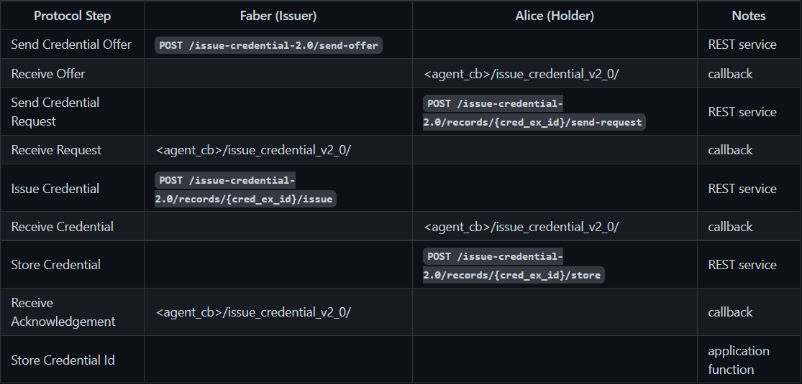
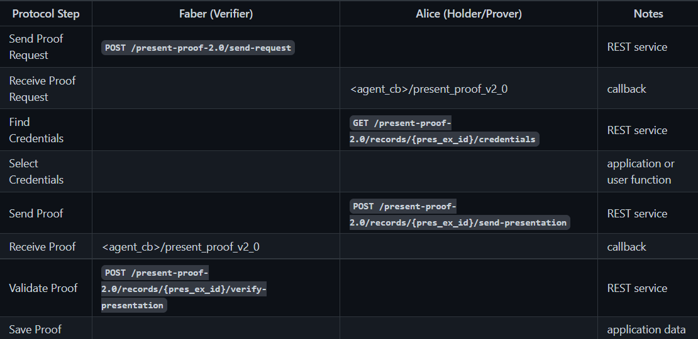

이해를 위해선 ACAPY의 Swagger UI가 필요합니다.   
ACAPY에서 진행할 수 있는 기본적인 Happy Path에 대한 정리입니다.

# Connection (Aries-rfcs 0160)
__두 에이전트 사이에 통신 가능한 채널을 생성해 안전하게 정보를 송수신 할 수 있게 만들어준다.__
1. __inviter__ : Create Invitation 
   
2. __invitee__ : Receive Invitation
    - 1,2 까지는 inviter, invitee 사이에 커넥션이 확립되기 전이기 때문에, out-of-band message 전송이 이루어져야 한다.
    - inviter에서 가지고 있는 invitation을 QR Code 형식으로 invitee에 전달하는 방식 등이 가능하다.
    - inviter와 inviee가 갖고 있는 connection id는 다르다! (GUID)
  
3. __invitee__ : Accept Invitation
    - ACAPY의 `--auto-accept-invites` 옵션을 통해 자동화 가능하다.

4. __inviter__ : Accept Request
    - 1~4 의 과정을 모두 마친 후에 Credential을 해당 connection channel을 통해 송수신할 수 있게 된다.
    - ACAPY의 `--auto-accept-requests` 옵션을 통해 자동화 가능하다.
  
5. 서로에게 메시지를 하나씩 송수신 하는 경우 수신하는 쪽의 connection의 status가 active로 변경됨.

# Basic Message (Aries-rfcs 0095)

## 메시지 송신

- 위에서 확립된 Connection의 id를 통해 메시지를 송신할 수 있다.

## 메시지 수신
- ACAPY agent 실행할 때 `--webhook-url {URL}`을 통해 명시해둔 URL을 통해 이벤트를 받을 수 있다. (POST 요청)
    - basic message의 경우는 `{URL}/topic/basicmessage`로 이벤트가 전송되며 이를 통해 메시지를 수신할 수 있다.
- 송신자도 동일하게 자신이 지정해둔 위치로 이벤트가 전송된다.
- [이 곳](https://github.com/hyperledger/aries-cloudagent-python/blob/main/AdminAPI.md) 을 통해 ACAPY에서 처리 가능한 웹훅에 대해 자세히 알 수 있다.
  

# Issue Credential

## prerequisite


전체적인 플로우는 위와 같으며, 따로 설정해준 것이 없는 이상 위의 플로우를 따라야 한다.
모든 플로우에 대해 웹훅(Notes 부분에 적혀있는 callback)을 구현해 작업한다면, ACAPY 프레임워크와 컨트롤러 사이에 많은 플로우를 처리해야 한다.
이를 어느정도 최소화하기 위해서, ACAPY 실행 시, 두개의 옵션을 추가로 전달한 후 작업할 예정이다.

- `--auto-respond-credential-offer`
- `--auto-respond-credential-request`

위의 두 옵션을 활성화 함으로써, 3개의 플로우를 자동화할 수 있다.
1. Holder에서 __Credential Offer__ 를 받는 행위
2. Holder에서 이에 맞게 __Credential Request__ 를 전송하는 행위
3. Issuer에서 __Credential Message__ 를 issue하는 행위   

이는 각 에이전트에서 자동화해야 하는 옵숀이기 때문에, __탈중앙화__ 를 고려했을 때에는 모든 플로우에 대해 웹훅으로 핸들링하는 것이 좋을 것 같다.

## 실제 플로우

1. Issuer에서 위의 __Endpoint__ 를 이용해 요청을 하면 Credential을 Holder에게 전송할 수 있다. 
    - 하지만 아직 완전히 Holder의 지갑에 저장된 상태는 아니며, credential exchange record에만 기록되어 있는 상태이다.
  

2. 위의 __Endpoint__ 에 요청하서 나온 값 중 `cred_ex_id`를 기억해둔 후,


3. 해당 __Endpoint__ 를 통해 현재 지갑 스토리지에 Credential을 저장하면 전체 플로우가 종료된다.
    - `/credentials` endpoint를 통해 저장된 값을 확인할 수 있게 된다.
    - `--auto-store-credential`을 통해 해당 기능 역시 자동화가 가능하다.
  

# Requesting / Presenting a Proof

## prerequisite

__Issue Credential__ 과 동일하게 기본적인 플로우는 위와 같으며, 웹훅을 구현해 작업해야 하는 부분이 있다. 이를 최소화하기 위해 두 개의 옵션을 추가로 전달 후 작업할 예정이다. 

- `--auto-respond-presentation-request`
    - __Verifier__ 가 __Holder__ 에 VP 요청을 전송했을 때, 조건에 맞는 __claim__ 들을 Credential에서 찾아서 VP를 전송한다.
    - __Holder__ 의 Agent에서 활성화
  
- `--auto-verify-presentation` 
    - __Holder__ 에서 전송한 VP를 __Verifier__ 에서 받자마자 자동으로 검증하게 한다.
    - __Verifier__ 의 Agent에서 활성화
  
## 실제 플로우


 위의 엔드포인트에 VP request를 전송하면, 나머지 플로우는 자동으로 진행되게 된다. 하지만 자동으로 진행되지 않는 경우가 있는데, 이를 두 가지 상황으로
구분할 수 있다.
1. `--auto-respond-presentation-request` 옵션이 제대로 수행되지 않는 경우
    - VP Request를 너무 포괄적이게 생성하는 등 자동으로 구분하지 못하는 경우가 존재하는 듯 했다. 이 경우 VP 요청에 대한 응답을 수동으로 생성해주거나,
  명확하게 제한을 잘 걸어서 VP request를 새로 생성한다면, 자동으로 진행됨을 확인할 수 있다. (수동 생성은 따로 진행해보지 않았다.)

2. `--auto-verify-presentation` 옵션이 제대로 수행되지 않는 경우
    - 이 경우는 Verifier에서 받은 VP에 대한 검증을 수행할 수 없을 때 자동으로 수행되지 않음을 확인할 수 있었다. 이 경우 `/present-proof/records/{pres_ex_id}/verify-presentation`
  엔드포인트를 이용해 수동으로 수행을 하여도 `internal server error(500)` 이 발생이 된다. 이 경우 따로 검증 실패라는 웹훅도 전송되지 않았는데, 어떻게 핸들링 할 지에 대해서는
      좀 더 고민을 해봐야겠다.
      

검증이 성공한 경우, 지정해둔 웹훅 엔드포인트로 정보가 전송되며, state 필드가 `verified`로 변경됨을 확인할 수 있다.


```javascript
// 아래와 같은 형태로 VP request 형태를 생성할 수 있다.
{
    name: 'test-proof-req',
    version: '1.0',
    requested_attributes: {
      attribute1_referent: {
        name: 'name',
        restrictions: [
          {
            schema_id: <schemaId>,
          },
        ],
      },
    },
    requested_predicates: {
      predicate1_referent: {
        name: 'age',
        p_type: '>=',
        p_value: 18,
        restrictions: [
          {
            schema_id: <schemaId>,
          },
        ],
      },
    },
  };
```


> Reference.   
> [aries-rfcs 0160 (connection-protocol)](https://github.com/hyperledger/aries-rfcs/tree/9b0aaa39df7e8bd434126c4b33c097aae78d65bf/features/0160-connection-protocol)   
> [aries-rfcs 0095 (basic-message)](https://github.com/hyperledger/aries-rfcs/tree/527849ec3aa2a8fd47a7bb6c57f918ff8bcb5e8c/features/0095-basic-message)    
> [aries-rfcs 0036 (issue-credential)](https://github.com/hyperledger/aries-rfcs/tree/bb42a6c35e0d5543718fb36dd099551ab192f7b0/features/0036-issue-credential)   
> [aries-rfcs 0037 (present-proof)](https://github.com/hyperledger/aries-rfcs/tree/4fae574c03f9f1013db30bf2c0c676b1122f7149/features/0037-present-proof)    
> [유용한 데모](https://github.com/hyperledger/aries-cloudagent-python/blob/main/demo/AriesOpenAPIDemo.md#start-the-faber-agent-1)       
> https://github.com/hyperledger/aries-cloudagent-python/blob/main/AdminAPI.md   